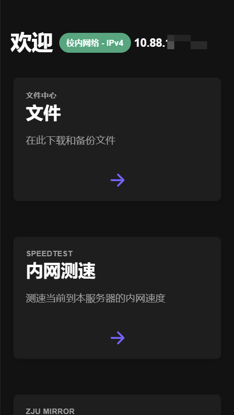

# Welcome
> ### 内网服务欢迎页面
> 
> [主地址(内网)](https://cloud.nbtca.space/)
> ```
> https://cloud.nbtca.space/
> ```

## 源码说明
- [src目录](src/)为欢迎页面的源码目录
  - 使用 [vue3](https://vuejs.org/) + [ionic7](https://ionicframework.com/) 开发
- 具体的文件服务见下方说明

## 架构/配置
- 系统使用 [iStoreOS - OpenWrt](https://www.istoreos.com/)
- 文件服务后端使用 [alist](https://github.com/alist-org/alist)
- webserver 服务使用 [nginx](https://openwrt.org/docs/guide-user/services/webserver/nginx)
  - nginx配置文件在[config/nginx](config/nginx/)目录
- 测速后端使用 [homebox](https://github.com/XGHeaven/homebox/tree/master)

## 图骗


